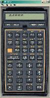

## v41 8E

[![download] (images/download.gif)] (http://hp41.org/file/V41R8.exe) 111MB

From its introduction in 1979 until final production in 1990, the Hewlett Packard 41 Series Programmable Calculator reigned supreme as the trusted companion of professionals and students worldwide. Its instant success was due to innovation, quality and a well established base of loyal customers. The HP-41 became the object of fascination to a vast following of dedicated enthusiasts which sprang up to explore its intricacies and possibilities. Even today, its classic design makes it a useful and collectable tool with yet a few surprises left. This site is dedicated to documenting and preserving this amazing machine.

Thanks to [HP-41.org] (http://www.hp41.org).
